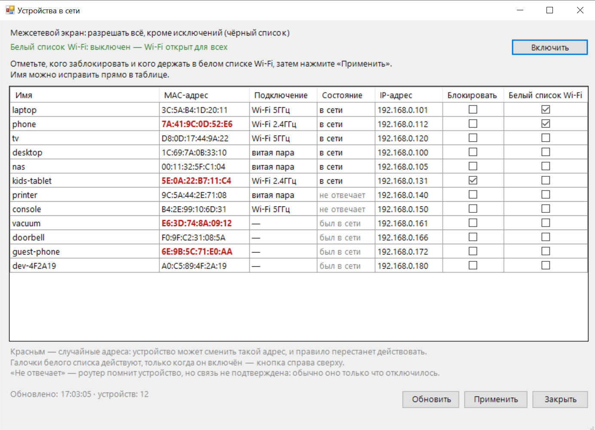

# dlink-dir825-macfilter

*English: [README.en.md](README.en.md) · протокол полностью переведён — [PROTOCOL.en.md](PROTOCOL.en.md)*

Блокировка и разблокировка устройств домашней сети на роутере **D-Link DIR-825ACG1** (проверено на прошивке **3.0.7**, аппаратная ревизия G1) — в окне со списком устройств или одной командой, без захода в веб-интерфейс.

Скрипты обращаются к недокументированному JSON-RPC API прошивки и правят два MAC-фильтра роутера. Фильтр межсетевого экрана оставляет устройство в сети, но без интернета, и действует и на Wi-Fi-клиентов, и на подключённых кабелем. Фильтр Wi-Fi решает, кого вообще пускать в беспроводную сеть, — на нём держится белый список.



*Главное окно: список устройств, галочки и состояние обоих фильтров. Устройства на снимке выдуманы.*

## Зачем

Штатный способ ограничить ребёнку интернет или отключить надоевшее устройство — зайти в веб-интерфейс, найти раздел, добавить правило, сохранить. Каждый раз. Здесь это окно со списком: галочка напротив устройства и «Применить». Или одна команда, если так привычнее.

## Требования

- Роутер D-Link DIR-825ACG1, прошивка 3.0.7 (сборка от 8 декабря 2021), аппаратная ревизия G1 — именно на ней всё проверялось. Возможно, подойдут и другие версии и модели на прошивке «anweb» с интерфейсом на `/admin/`, но это не проверялось.
- Windows с PowerShell 5.1 (входит в состав системы)
- Пароль администратора роутера

## Установка

1. Скачайте или клонируйте репозиторий в любую папку.

Дальше все команды выполняются в этой папке. Проще всего открыть её в проводнике и набрать `powershell` в адресной строке — консоль откроется сразу в нужном месте.

2. Разрешите Windows выполнять сценарии. Оба действия делаются один раз, права администратора не нужны:

```powershell
Unblock-File -Path .\*.ps1
Set-ExecutionPolicy -Scope CurrentUser RemoteSigned
```

`Unblock-File` снимает с файлов пометку «получено из интернета»; он нужен, только если репозиторий скачан архивом — после `git clone` такой пометки нет. `RemoteSigned` для своей учётной записи разрешает запускать локальные сценарии, оставляя запрет на скачанные неподписанные, — поэтому пометку и приходится снимать отдельно.

3. Выполните первичную настройку:

```powershell
.\dlink-macfilter.ps1 setup
```

Скрипт спросит пароль от роутера, создаст `devices.json` и положит на рабочий стол ярлык `Devices`. Пароль сохраняется в `cred.xml`, зашифрованный средствами Windows DPAPI: расшифровать его сможет только та же учётная запись на том же компьютере. В коде и в ярлыках пароля нет.

4. Откройте ярлык `Devices` — в окне будут все устройства, которые роутер видит сейчас или видел за сутки. Впишите им понятные имена и отмечайте галочками, кого блокировать.

Искать MAC-адреса в веб-интерфейсе и вписывать их руками не нужно: окно собирает список само. Файлы `devices.json` и `whitelist.json` можно править и в редакторе — образцы лежат рядом, `devices.example.json` и `whitelist.example.json`.

### Если менять политику выполнения не хочется

Разрешить запуск можно и на один раз — ключом `-ExecutionPolicy Bypass` у `powershell.exe`. В инструкции его нет намеренно: браузеры и антивирусы предупреждают о скопированных с веб-страницы командах с этим ключом, потому что именно так распространяют вредоносные скрипты. Предупреждение справедливое — команда со страницы, которую вы видите впервые, стоит того, чтобы насторожиться, и эта не исключение.

## Команды

| Команда | Действие |
|---|---|
| `.\dlink-macfilter.ps1 status` | показать текущее состояние фильтра |
| `.\dlink-macfilter.ps1 block -Name tv` | заблокировать устройство |
| `.\dlink-macfilter.ps1 unblock -Name tv` | разблокировать |
| `.\dlink-macfilter.ps1 toggle -Name tv` | переключить состояние |
| `.\dlink-macfilter.ps1 remove -Name tv` | удалить правило совсем |
| `.\dlink-macfilter.ps1 dump` | сырой ответ роутера, для диагностики |

`unblock` не удаляет правило, а выключает его: повторная блокировка потом стоит одного запроса, и прошлые блокировки остаются видны. `remove` удаляет запись насовсем — это для адресов, которые больше не вернутся.

Вместо `-Name` можно указать адрес напрямую:

```powershell
.\dlink-macfilter.ps1 block -Mac AA:BB:CC:DD:EE:01
```

Адрес роутера по умолчанию `192.168.0.1`, имя пользователя `admin`. Если у вас иначе — параметры `-Router` и `-User`.

## Окно выбора устройств

```powershell
.\pick-devices.ps1
```

Главное окно и единственное, которое нужно для повседневной работы. Оно показывает, кого роутер видит сейчас или видел за последние сутки, а вы отмечаете галочками, кого заблокировать и кого пустить по белому списку Wi-Fi. Адреса вводить не нужно.

Сверху — состояние обоих режимов фильтрации:

- **Межсетевой экран** — политика по умолчанию: разрешать всё, кроме исключений (чёрный список), или наоборот.
- **Белый список Wi-Fi** — включён или выключен. Когда включён, надпись красная: в этом режиме к беспроводной сети не подключится никто, кроме отмеченных.

Чтение состояния ничего не записывает в роутер, поэтому окно можно открывать сколько угодно.

| Столбец | Что означает |
|---|---|
| Имя | подставляется из имени узла, редактируется прямо в таблице; сохраняется в `devices.json` |
| MAC-адрес | **красным** — случайный адрес, см. ниже |
| Подключение | Wi-Fi с диапазоном, витая пара или прочерк, если устройства сейчас нет в сети |
| Состояние | «в сети», «не отвечает» или «был в сети» — см. ниже |
| Блокировать | правило межсетевого экрана; отмеченное устройство теряет интернет сразу после «Применить» |
| Белый список Wi-Fi | запись в `whitelist.json`; действует, только когда белый список включён |

Правки в таблице сами по себе ничего не сохраняют: Enter лишь заканчивает ввод в ячейке. Пока есть несохранённое, внизу окна горит напоминание. Кнопка «Применить» сначала показывает список того, что будет сделано, и предупреждает отдельно, если среди отмеченных есть устройства со случайным адресом. До подтверждения не меняется ничего.

Список собирается из четырёх источников: клиенты роутера, аренды DHCP, беспроводные соединения и текущие правила фильтра. К ним добавляются устройства из `devices.json` и `whitelist.json`, даже если сейчас их нет в сети, — иначе снять с них галочку было бы невозможно. Тип подключения не теряется, когда устройство пропадает: окно запоминает последнее известное на время своей работы и показывает его серым.

`devices.json` работает как реестр имён: туда попадает всё, чему вы вписали имя руками, и всё, что хоть раз блокировали. Больше он ни на что не влияет.

Галочка белого списка доступна и у проводных устройств, но толку от неё там нет: по Wi-Fi компьютер выходит через другой адаптер, со своим MAC-адресом, и появляется в таблице отдельной строкой — отмечать нужно именно её.

Тот же список текстом, без окна и без возможности что-либо изменить:

```powershell
.\pick-devices.ps1 -Text
```

### Три состояния, а не два

| Состояние | Что за этим стоит |
|---|---|
| в сети | связь подтверждена: устройство соединено с точкой доступа либо недавно отвечало |
| не отвечает | роутер его помнит, но связь не подтверждена — обычно устройство только что отключилось |
| был в сети | в списке клиентов его нет вовсе, осталась лишь аренда DHCP за последние сутки |

Промежуточное «не отвечает» — не признак неисправности: так какое-то время выглядит только что выключенный компьютер. Точнее роутер сказать не может, [почему — в PROTOCOL.md](PROTOCOL.md).

### Почему часть адресов выделена красным

Телефоны и планшеты по умолчанию подключаются к Wi-Fi не с аппаратным адресом, а с придуманным на ходу. Правило, записанное на такой адрес, может в любой момент перестать работать: устройство вернётся в сеть под другим адресом, и правило останется висеть на прежнем.

Такой адрес виден по первому байту: он оканчивается на 2, 6, A или E. Пометка означает «адрес **может** смениться» — сказать, сменится ли на самом деле, по адресу нельзя ([подробности в PROTOCOL.md](PROTOCOL.md)).

### Уборка накопившегося

Устройство со сменившимся адресом оставляет после себя запись, которая уже никогда не пригодится. За месяцы таких накапливается, и таблица зарастает.

Правый щелчок по строке → **«Убрать … из списков»**. Запись исчезает отовсюду разом: имя из `devices.json`, отметка из `whitelist.json` и из фильтра на роутере, правило межсетевого экрана. Перед этим окно показывает, что именно будет удалено, и предупреждает, если устройство сейчас в сети — тогда оно вернётся в таблицу новой строкой, уже без имени и отметок.

Отличать мёртвый адрес от временно выключенного устройства инструмент не берётся: роутер помнит аренды сутки, и телефон, уехавший на дачу, для него неотличим от исчезнувшего навсегда. Окно показывает факты — когда адрес видели последний раз и что о нём записано, — а решение остаётся за вами.

### Если отключить рандомизацию

Устройство вернётся в сеть под аппаратным адресом — а это **другой адрес**. В таблице появится новая строка, уже не красная, а старая запись останется указывать на адрес, который больше никогда не придёт.

⚠️ Отсюда две ловушки. Блокировка на старом адресе перестанет действовать, и устройство вернётся разрешённым. А если в этот момент включён белый список, устройство окажется отрезано от Wi-Fi, пока вы не отметите его новую строку.

## Белый список Wi-Fi

Второй, независимый режим: оставить доступ к беспроводной сети только заранее заданным устройствам, все остальные не смогут подключиться.

Обычно им управляют прямо из окна: кнопка справа сверху включает и выключает список, а её надпись меняется по текущему состоянию, которое написано слева от неё. Включение спрашивает подтверждение и показывает, кто сохранит доступ. Пока в таблице есть несохранённые галочки, кнопка откажется работать — иначе список включился бы в том виде, в каком был до правок.

Те же действия из командной строки:

```powershell
.\wifi-whitelist.ps1 status
.\wifi-whitelist.ps1 on
.\wifi-whitelist.ps1 off
.\wifi-whitelist.ps1 sync
```

Перед работой скрипт смотрит устройство сети — включено ли радио в диапазоне и сколько в нём сетей. Выключенный диапазон пропускается: писать в него правила незачем, и пустой список для него не повод отказываться от включения. Появится вторая сеть в диапазоне (гостевая) — снова начнёт ставиться курсор её выбора, без которого операция ушла бы не в ту сеть молча. Это единственное, что читается из настроек Wi-Fi; имена сетей, пароли и каналы не затрагиваются.

`sync` приводит список на роутере в соответствие с `whitelist.json`: удаляет лишние адреса и добавляет недостающие, не трогая саму политику доступа. Нужен потому, что `on` умеет только добавлять — без синхронизации вычеркнутое из файла устройство сохранило бы доступ к Wi-Fi. Окно выбора устройств вызывает `sync` само, вручную он нужен только после правки файла в редакторе.

Если `whitelist.json` ещё нет — например, проект только что скачан на другой компьютер, — окно берёт отметки прямо с роутера и пишет об этом внизу. Файл появится при первом сохранении или при включении списка ([почему так — в PROTOCOL.md](PROTOCOL.md)).

Список устройств — в `whitelist.json`, образец лежит в `whitelist.example.json`:

```json
[
  { "name": "laptop", "mac": "AA:BB:CC:DD:EE:01", "band": "both" },
  { "name": "phone-5ghz", "mac": "AA:BB:CC:DD:EE:02", "band": "5" }
]
```

`band` принимает `both` (по умолчанию), `2.4` или `5`.

### Почему один адрес попадает в оба диапазона

Фильтр на роутере раздельный: свой список у 2,4 ГГц, свой у 5 ГГц. А аппаратный MAC-адрес принадлежит адаптеру, а не сети — ноутбук приходит с одним и тем же адресом и на `2.4`, и на `5`. Значит, чтобы пустить его в обе сети, этот единственный адрес обязан лежать в обоих списках. Это и делает `both`.

Устройство с включённой рандомизацией MAC ведёт себя наоборот: оно генерирует **разный** адрес для каждой сети, поэтому занимает две отдельные записи с разными адресами, каждая со своим диапазоном.

Оба случая рядом выглядят непоследовательно, хотя верны: у одного устройства один адрес на два диапазона, у другого два адреса на два диапазона. Окно подтверждения при включении показывает список по устройствам, а не по фильтрам, — так эта разница видна сразу.

### Чем это отличается от block / unblock

| | `block` / `unblock` | Белый список |
|---|---|---|
| Механизм | MAC-фильтр межсетевого экрана | MAC-фильтр Wi-Fi |
| На что действует | Wi-Fi **и** кабель | только Wi-Fi |
| Что происходит с устройством | подключено, но без интернета | не может подключиться к сети |
| Логика | запрещаем перечисленных | разрешаем только перечисленных |

Режимы независимы и не конфликтуют: они живут в разных конфигурациях роутера. Проводные устройства при включённом белом списке сохраняют доступ и управляются через `block` / `unblock`.

### Защита от самоблокировки

Wi-Fi-фильтр перекрывает и доступ к веб-интерфейсу роутера, поэтому включение отклоняется, если:

- в белом списке нет ни одного сетевого адаптера компьютера, с которого запущен скрипт;
- список пуст хотя бы для одного диапазона.

Если ваш адрес есть на одном диапазоне, но отсутствует на другом, окно подтверждения об этом предупредит. Проверки можно снять ключом `-Force`, но тогда вы рискуете потерять управление роутером.

Порядок операций выбран так, чтобы сбой не запирал сеть: сначала на оба диапазона добавляются все адреса и только последними командами включается политика. Если что-то пойдёт не так на середине, фильтр останется выключенным.

Даже при ошибке доступ восстанавливается кабелем: на LAN-порты этот фильтр не распространяется.

`off` не удаляет адреса, а лишь отключает политику — повторное включение проходит быстрее.

## Ярлык на рабочем столе

Ярлык `Devices` создаётся один раз, при первичной настройке — отдельного действия не требуется. Если он не нужен, запустите настройку с ключом `-NoShortcut`.

Пересоздать его (например, после переноса папки — в ярлыке хранится абсолютный путь) можно повторным запуском настройки: пароль и списки при этом не трогаются.

```powershell
.\dlink-macfilter.ps1 setup
```

Ярлык работает независимо от политики выполнения скриптов: нужный ключ зашит внутрь.

## Как это устроено

Прошивка «anweb» под веб-интерфейсом держит недокументированный JSON-RPC API, разобранный по JavaScript самого интерфейса. Полный разбор — форматы данных, подводные камни, способ переразобрать всё заново после обновления прошивки — в [PROTOCOL.md](PROTOCOL.md).

## Ограничения

**Пять попыток пароля.** После них роутер временно блокирует авторизацию. Если пароль сохранён неверно, удалите `cred.xml` и выполните `setup` заново.

**Износ флеш-памяти.** Изменения записываются во флеш роутера — одной командой на операцию. Для ручных переключений это нормально, для автоматического цикла раз в минуту — нет. Просмотр состояния не пишет ничего.

**Совместимость.** API не документирован, производитель ничего о нём не обещал. Обновление прошивки может сломать скрипты.

## Проверка результата

Веб-интерфейс роутера, раздел **Межсетевой экран → MAC-фильтр**. Режим по умолчанию должен оставаться «Разрешить», а заблокированные устройства — быть в списке исключений с действием «Запретить».

## Файлы

| Файл | Назначение |
|---|---|
| `dlink-macfilter.ps1` | блокировка отдельных устройств |
| `wifi-whitelist.ps1` | белый список Wi-Fi |
| `router-api.ps1` | общий слой доступа к API роутера |
| `pick-devices.ps1` | окно выбора устройств для обоих списков |
| `devices.example.json` | образец списка устройств |
| `whitelist.example.json` | образец белого списка |
| `cred.xml` | пароль, создаётся при `setup`, в репозиторий не попадает |
| `devices.json` | ваш список устройств, в репозиторий не попадает |
| `whitelist.json` | ваш белый список, в репозиторий не попадает |

Папку можно переносить целиком: скрипты ищут своё состояние рядом с собой. Отдельно взятый скрипт не работает — всем им нужен `router-api.ps1` в той же папке, там реализована авторизация на роутере.

## Лицензия

[MIT](LICENSE). Пользуйтесь, изменяйте и распространяйте свободно, сохраняя указание авторства.

## Отказ от ответственности

Проект не связан с компанией D-Link. Используется недокументированный интерфейс, поведение которого производитель может изменить в любой момент. Используйте на свой риск и на своём оборудовании.
